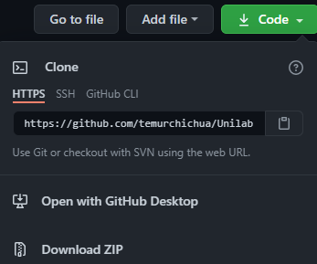

# პროექტში კონტრიბუცია

## Fork the repository

პროექტზე ერთობლივად სამუშაოდ დაფორკეთ ეს რეპოზიტორია. ამისთვის დააჭირეთ fork ღილაკს ზედა მარჯვენა ზოლში. ამ რიგად თქვენს ანგარიშზე გაჩნდება რეპოზიტორიის ასლი.


## Clone the repository

საკუთარ ანგარიშზე გაჩენილი დაფორკილი რეპოზიტორია გადაიტანეთ/დაკლონეთ თქვენს მოწყობილობაში. ამისთვის თქვენს ანგარიშზე გახსენით დაფორკილი რეპოზიტორია, დააჭირეთ clone ღილაკს და copy to clipboard იკონს.



თქვენს სამუშაო გარემოში გახსენით ტერმინალი და ჩააკოპირეთ შემდეგი გიტ კომანდი:

```shell
git clone <მისამართი რომელიც დააკოპირეთ კლონირებისთვის>
```

"<>"- სიმბოლოების წაშლით და ქლიფბორდში დაკოპირებული მისამართის ჩასმით მიიღებთ ბრძანების საბოლოო სახეს. მაგალითისთვის, თქვენგან დაფორკილ ამ რეპოზიტორიის მისამართს ექნება შემდეგნაირი სახე:

```shell
git clone https://github.com/this_is_you/firstrepo.git
```

სადაც this_is_you არის თქვენი GitHub username. ამ რიგად თქვენ აკოპირებთ პირველი რეპოზიტორიის თქვენ მიერ დაფორკილ ვერსიას სამუშაო მოწყობილობაზე.

## Make changes in project

მას შემდეგ რაც გაამზადებთ პროექტს თქვენს მოწყობილობაში, დაამატეთ დირექტორიას თქვენი კოდი და პროექტის აღწერა /firstProjects საქაღალდეში საკუთარი საქაღალდის შექმნით.

საქაღალდის დასახელება /სახელი_გვარი ფორმატით გაამზადეთ, ხოლო ფაილები: readme.md, app.py დასახელებებით.

```
firstrepo
│
│ some_files
│
└─── firstProject
│   └─── temur_chichua
│        │ app.py
│        │ readme.md

```

ამის შემდეგ გახსენით დირექტორიის საწყის დონეზე განთავსებული README.md ფაილი და ქვემოთ მოცემულ კონტრიბუტორები გრაფაში განათავსეთ თქვენი სახელი, გიტჰაბის მისამართი, პროექტის დასაღელება და პროექტის readme.mdის მისამართი, როგორც შაბლონზეა ნაჩვენები.


### Create a branch

სამუშაო გარემოში, ტერმინალი გადაიყვანეთ გადმოწერილი რეპოზიტორიის დირექტორიაში/საქაღალდის მისამართზე. იმ შემთხვევაში თუ უკვე იქ არ იმყოფებით, გამოიყენეთ შემდეგი ბრძანება:

```shell
cd firstrepo
```

ახლა კი შევქმნათ ახალი ტოტი/branch git checkout ბრძანების გამოყენებით:

```shell
git checkout -b <add-your-new-branch-name>
```

სადაც add-your-new-branch-name შეიძლება იყოს ნებისმიერი სახელი, რომლითაც ტოტზე შესასრულებელ სამუშაოს ლაკონურად აღწერთ, მაგალითად:

```shell
git checkout -b adding-my-code
```

### Commit changes

თუ პროექტის დირექტორიაში გაუშვებთ ბრძანებას git status, როგორც მაგალითზეა ნაჩვენები, გამოჩნდება თქვენს მიერ დამატებული ფაილები რომელიც არ არის დამატებული გიტის რეპოზიტორიაში.

მათ რეპოზიტორიაში დასამატებლად უნდა გამოვიყენოთ git add ბრძანება:

```shell
git add .
```

ბრძანებაში . რეპოზიტორიაში დაამატებს დირექტორიაში არსებულ ყველა იმ ფაილს რომელიც არ არის გამოყოფილი .gitignore ფაილში.

აუცილებელია დავაკომიტოთ პროექტში შეტანილი ცვლილებები git commit ბრძანების გამოყენებით.:

```shell
git commit -m დავამატე ჩემი პროგრამა და <your-name> კონტრიბუტორთა სიაში
```

შეცვალეთ <your-name> თქვენი სახელით. ბრჭყალებში მითითებული ტექსტი უნდა ასახავდეს კომიტის მიზანს, ანუ ორ სიტყვიან შეჯამებას თუ რა ცვლილებები მოხდა ამ ნაბიჯზე.

### Push changes to GitHub

საბოლოოდ საჭიროა ავტვირთოთ პროექტში ლოკალურად შეტანილი ცვლილებები ქლაუდზე, git push ბრძანების მეშვეობით:

```shell
git push origin <add-your-branch-name>
```

შეცვალეთ <add-your-branch-name> სახელით რომელიც თქვენი ტოტის/branch-ის შექმნისთვის გამოიყენეთ.

### Submit your changes for review

თქვენს GitHub რეპოზიტორიაში შეამჩნევთ Compare & pull request ღილაკი. გააქტიურეთ ღილაკი მასზე დაჭერით. დაასაბმითეთ თქვენს მიერ გაკეთებული pull მოთხოვნა.

თქვენი მოთხოვნის ნახვის შემდეგ მე შევძლებ გავაერთიანო/merge თქვენი კონტრიბუცია მთელს პროექტთან. ჩემს ქმედებაზე შეტყობინება მოგივათ მეილზე და შეტყობინებებში, რის შემდეგაც თქვენს მიერ შეტანილი ცვლილება გამოჩნდება პროექტის მასტერ ბრენჩზე.

## რესურსები

git-ის ოფიციალური დოკუმენტაცია: https://git-scm.com/doc​

git -ის სრული კურსი: https://youtu.be/RGOj5yH7evk